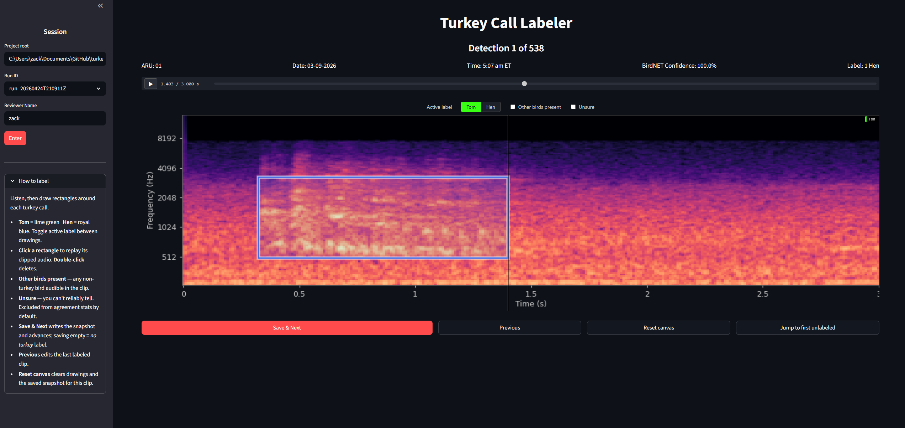

# turkey-audio-detection

Modular pipeline for detecting and reviewing Wild Turkey vocalizations in ARU (autonomous recording unit) audio. Runs BirdNET on WAV recordings, extracts candidate clips, and provides a Streamlit app for labeling and inter-rater adjudication.

The labeling stage produces a reviewed dataset of time–frequency regions on each 3-second candidate clip, each region tagged Tom or Hen. Clips with no turkey are saved with an empty region list (with an optional "other birds present" flag). BirdNET performs the candidate detection; a turkey-specific frame-level model trained on the reviewed regions then localizes the exact timing, duration, and sex of each call.

## Data layout

Place raw audio under `data/ARU_<id>/` inside your project root. WAV files must follow the naming convention `<device_id>_YYYYMMDD_HHMMSS.wav` (e.g. `2MA09358_20260304_051500.wav`). Files that don't match are quarantined rather than crashing the pipeline.

All generated outputs are written under `data/_outputs/` and are excluded from version control.

```
project-root/
├── data/
│   ├── ARU_01/          ← raw audio (read-only, not committed)
│   │   └── *.wav
│   └── _outputs/        ← generated (not committed)
│       ├── runs/<run_id>/
│       └── review/
```

## Collaborator quickstart (Windows)

**Requirements:** Git for Windows, Anaconda or Miniconda.

1. Clone the repository:

   ```
   git clone https://github.com/ZackLoken/turkey-audio-detection.git
   cd turkey-audio-detection
   ```

2. Create and activate the conda environment:

   ```
   conda env create -f gobbler.yml
   conda activate gobbler
   ```

3. Install the package into the active environment:

   ```
   pip install -e .
   ```

4. Put your audio data in `data/ARU_01/` (or `data/ARU_02/`, etc.) and run the full pipeline:

   ```
   python -m turkey_audio_detection.cli run-all --project-root "C:\path\to\your\project"
   ```

   The pipeline prints a `run_id` (e.g. `run_20260424T205153Z`) when it finishes — **note it**, you'll need it for the review app.

   > **Note:** All commands in this README invoke the package as a Python module (`python -m turkey_audio_detection.cli ...`). The package also installs short console-script wrappers (`turkey-pipeline`, `turkey-review`, etc.) for convenience, but some locked-down lab machines block unsigned `.exe` wrappers under managed antivirus / AppLocker — the `python -m` form sidesteps that and works everywhere.

   > **Note:** TensorFlow and BirdNET print verbose INFO/WARNING messages to the console during startup. These are normal and can be ignored. A progress bar shows per-file status while BirdNET is running.

5. Launch the review app:

   ```
   python -m turkey_audio_detection.app
   ```

   In the sidebar enter your **project root**, the **run ID** from step 4, and a **reviewer name**. For each clip, draw rectangles on the spectrogram around any Tom or Hen calls (switch the active-label radio between Tom and Hen as needed), tick **Other birds present** / **Unsure** when relevant, then click **Save & Next**. See the [Review app](#review-app) section below for details.

**Troubleshooting:**
- If `birdnetlib` fails to import, confirm ffmpeg is on your PATH: `conda install -c conda-forge ffmpeg`
- If BirdNET is slow, add `--prime-window-only` to limit processing to recordings near sunrise
- If audio playback is silent, check that your WAV files are readable: `python -c "import soundfile; print(soundfile.info('yourfile.wav'))"`

## Stage-by-stage CLI usage

All outputs are written under `data/_outputs/runs/<run_id>/`.

```
# Index recordings and compute sunrise windows
python -m turkey_audio_detection.cli index-data --project-root .

# Run BirdNET on indexed files (use run_id from previous step)
python -m turkey_audio_detection.cli run-birdnet --project-root . --run-id <run_id>

# Extract 3-second review clips for Wild Turkey detections
python -m turkey_audio_detection.cli extract-clips --project-root . --run-id <run_id>

# Or run all three stages at once
python -m turkey_audio_detection.cli run-all --project-root .

# Compute inter-rater Cohen's kappa from reviewer label files
python -m turkey_audio_detection.cli adjudicate --project-root .
```

## Review app

```
python -m turkey_audio_detection.app
```



- **Sidebar:** set project root, select run ID, enter reviewer name. The collapsible *How to label* expander lives below.
- **Main panel:** custom audio control and a mel spectrogram pinned to 50–14000 Hz with labeled time and frequency axes. The vertical black bar over the spectrogram tracks the audio playhead.
- **Region annotation:**
  - Toggle the active label (`Tom` = lime green, `Hen` = royal blue) between drawings to label both call types on one clip
  - Drag rectangles on the spectrogram around each call; the rectangle's x-extent encodes time, y-extent encodes frequency. Each box is auto-previewed (audio bandpass-filtered to the box's frequency bounds) the moment you finish drawing
  - **Click** an existing rectangle to replay its band-limited audio; **double-click** to delete it
  - Tick **Other birds present** when any non-turkey bird is audible in the clip
  - Tick **Unsure** when you can't reliably tell whether a turkey is in the clip — these rows are excluded from agreement stats by default
- **Save & Next** writes one row to `data/_outputs/review/labels/<reviewer_id>.csv` and advances. Saving on an empty canvas creates an explicit *no turkey* label. **Previous** revisits a labeled clip (regions re-render so you can edit them). **Reset canvas** clears drawings *and* removes any saved snapshot for the clip so it becomes unlabeled again. **Jump to first unlabeled** seeks to the next clip without a saved snapshot.
- Each CSV row contains: `item_id, detection_id, reviewer_id, reviewer_name, regions_json, other_birds_present, unsure, tom_present, hen_present, label_timestamp_utc, session_id`. `regions_json` is a JSON list of `{start_s, end_s, freq_min_hz, freq_max_hz, label}` objects; `tom_present` / `hen_present` are denormalized for cheap filtering.
- Run `adjudicate` after two reviewers finish to get pairwise Cohen's kappa **per attribute** (`tom_present` and `hen_present`) and a disagreements export tagged by attribute.

## Training, evaluation, and classification

Once reviewers have produced labeled clips, train the frame-level sound-event-detection (SED) model, evaluate it, and run it directly over full recordings. BirdNET is only a labeling aid (proposing review candidates); it is not used at inference. Training and inference run in PyTorch on CUDA; the first run downloads the BirdSet ConvNeXt weights (~390 MB) to the Hugging Face cache.

First, copy `site_map.example.csv` to `data/site_map.csv` and fill in one `aru_id,site_id` row per ARU so train/val/test split by **site** (unmapped ARUs fall back to one-site-per-ARU). `data/` is gitignored, so your populated map stays local and is never overwritten by updates.

```
# Train on one or more runs' labels. Aggregates per-reviewer CSVs via majority vote,
# splits train/val/test grouped by SITE (+ optional --holdout-year) to avoid leakage,
# then fine-tunes a BirdSet-pretrained ConvNeXt frontend with a BiGRU temporal head,
# gradually unfreezing backbone stages across phases (scaling LR/batch, early stopping).
python -m turkey_audio_detection.cli train --project-root . --run-id <run_id> [--run-id <run_id> ...]

# Evaluate on the held-out test split: per-class event precision/recall/F1 with
# time-axis IoU matching (swept over several IoU thresholds) + segment F1.
python -m turkey_audio_detection.cli evaluate --project-root . --model-id <model_id> --run-id <run_id>

# Optuna hyperparameter search (resumable when given a --storage sqlite path).
python -m turkey_audio_detection.cli hpo --project-root . --run-id <run_id> --n-trials 30 --storage hpo.db

# Run the trained model over full recordings (sliding window; no BirdNET). Emits
# per-call events (start_s, end_s, sex, score) and presence/counts per site/day.
python -m turkey_audio_detection.cli classify --project-root . --model-id <model_id> --audio-glob "data/ARU_*/**/*.wav"
```

**Outputs:**
- `data/_outputs/models/<model_id>/checkpoint.pt` — best-validation model state + config + mel params + per-class thresholds
- `data/_outputs/models/<model_id>/train_metrics.csv` — per-phase/epoch loss + frame-level precision/recall/F1
- `data/_outputs/models/<model_id>/splits.csv` — train/val/test assignment with `site_id`
- `data/_outputs/models/<model_id>/eval.csv` — event-level metrics (IoU sweep) + segment F1
- `data/_outputs/inference/<inference_id>/events/<source_filename>.csv` — per-call events `(start_time_s, end_time_s, sex, score)`
- `data/_outputs/inference/<inference_id>/aggregate_counts.csv` — presence + call counts per site/day/sex

**Architecture:**
- Input: 3-second clip → torchaudio log-mel (128 mels), matched to the BirdSet checkpoint's preprocessing so the pretrained weights stay valid
- Backbone: [`DBD-research-group/ConvNeXT-Base-BirdSet-XCL`](https://huggingface.co/DBD-research-group/ConvNeXT-Base-BirdSet-XCL) (bird-pretrained); the first two stages are tapped (~80 ms/frame) and the deeper stages dropped; gradually unfrozen during fine-tuning
- Head: collapse frequency → BiGRU (or TCN) temporal head → per-frame Tom/Hen sigmoid logits
- Loss: per-frame focal (or BCE) on time-projected box targets; rejected candidates (no turkey) become all-zero negatives
- Inference: the trained model slides over the **full recording** → average overlapping per-frame probs → per-class threshold → group frames into events → counts (BirdNET is not used at inference)
- Whole-recording negatives: because inference runs over full audio, training needs negatives sampled from across recordings (not only review-rejected candidates) to avoid over-firing — to be added once labeled data exists
- Augmentation: SpecAugment + linear-power Mixup / background-mix

**Splits & aggregation:** `train` groups train/val/test by site and can hold out whole years with `--holdout-year`. By default only consensus clips are used; pass `--include-non-consensus` to include disagreement-flagged clips.
